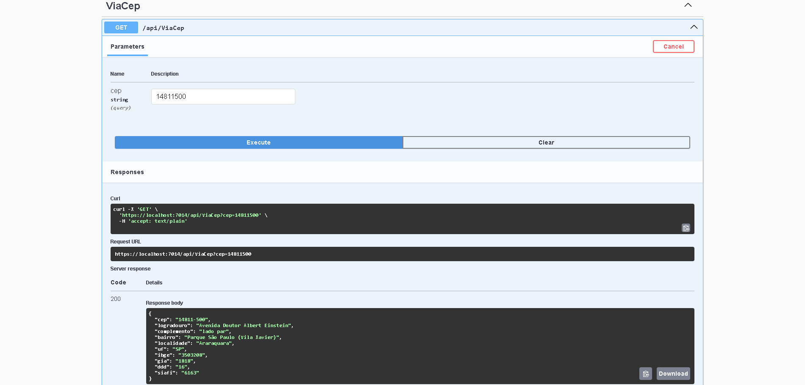
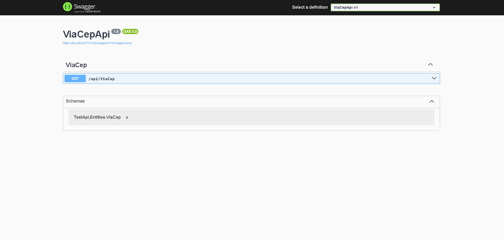

# 🏡 Projeto de Integração com ViaCEP

Este projeto fornece uma integração com a API pública do ViaCEP para consulta de endereços a partir de códigos postais (CEP) brasileiros.

---

## 🎯 Objetivo Principal

Implementar uma solução robusta e eficiente para:

* 🔍 Consultar dados de endereços via CEP
* 🔗 Integrar com a API pública do ViaCEP
* 🧩 Fornecer uma interface simples para consumo em aplicações **.NET**

---

## 🚀 Funcionalidades Principais

✅ Consulta de endereços por CEP

✅ Tratamento de erros da API

✅ Configuração simplificada com **Refit**

✅ Injeção de dependência pronta para uso

---

## 🛠️ Padrões de Projeto Utilizados

* **Inversão de Controle (IoC)** : Utilizado através de injeção de dependência
* **Repository Pattern** : Abstração da fonte de dados
* **Adapter Pattern** : Adaptação da API externa (ViaCEP) para uma interface interna reutilizável

---

## ⚙️ Requisitos Técnicos

* [.NET 6+]()
* [Refit](https://github.com/reactiveui/refit) (para requisições HTTP tipadas)
* Configuração padrão de **Dependency Injection** do ASP.NET Core

<h1>Swagger</h1>

  

  

